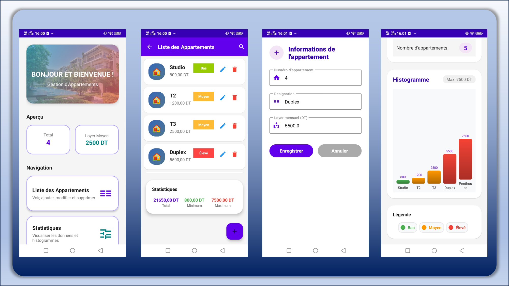

# 📱 INSATL Kotlin App


---

## 📸 Aperçu

<p align="center">
  
</p>

---

## 🚀 Lancement rapide (Windows)

Un script PowerShell est fourni pour automatiser totalement le lancement du projet.

### ▶️ Commande

```bash
.\rundev.ps1